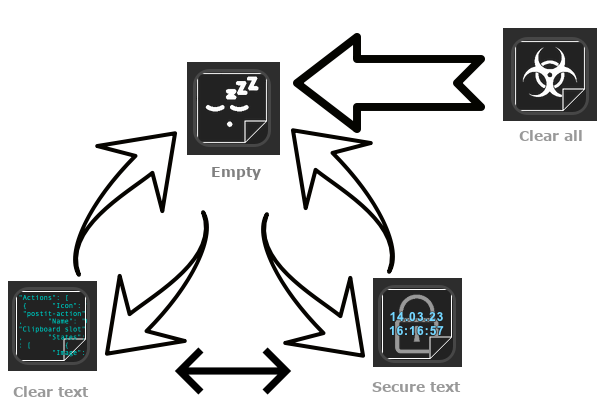

# streamdeck-clipboard-buddy

- [streamdeck-clipboard-buddy](#streamdeck-clipboard-buddy)
  - [About](#about)
    - [Left To Do (not comprehensive)](#left-to-do-not-comprehensive)
    - [Requirements](#requirements)
    - [Usage](#usage)
    - [Security decisions](#security-decisions)
  - [Development](#development)
    - [Getting started](#getting-started)
    - [Build](#build)
    - [Testing](#testing)
    - [Release](#release)
  - [Wall of Thanks](#wall-of-thanks)
  - [License](#license)

## About

A Stream Deck plugin for Mac to have some clipboard entries handy (independently from clipboard always changing status).

If you are on Windows, check [BarRaider](https://github.com/BarRaider)'s "Multi Clip" function available in his [Win Tools](https://github.com/BarRaider/streamdeck-wintools) plugin.

### Left To Do (not comprehensive)

Here is the list of functionalities that are either missing or incomplete:

- dialog to ask for a label when activating the secure storage mode
- add setting to enable a way for users to define how big they want their text preview
- refine the rendering code to avoid having text getting out of the post-it background

### Requirements

In order to benefit from this plugin you will need:

- a Stream Deck device or the mobile app
- a Mac
- the need to keep some text around for multiple re-use :p

### Usage

Once assigned to a key, you will be able to use this as a slot for keeping something you just copied into your clipboard:

- __to save or replace__: hold the key until the text appears (taken from the clipboard)
- __to use__: press the key to paste it wherever the focus is

(see the Security sub-section below on the 2 possible ways to save text)

### Security decisions

The content of the clipboard can be sensitive (API key, password, confidential text...) so you may benefit from this plugin but do not want to risk leaking info. That is why the following decisions have been made implementing the plugin:

- the data is not persisted across reboots/reloads of the Stream Deck software (the same way the clipboard is)
- you can hide the saved content by pressing the key for more than 3 seconds: this way, the text will be saved but you will be able to type an identification to display on the key

## Development

### Getting started
Open the XCode project file in Sources and have fun !

### Build
To build, you can either use the XCode UI or use the complete flow script **local_test.sh**.

### Testing
To help you with local testing, you can either use the **_grab-build-for-dev.sh** script that will take the binary generated by XCode and put it into the open-folder version of the plugin in the repo. 
If you use the **local_test.sh** script, it will take the binary out of the command-line build and put it in the same location.

Once in the open-folder plugin, the **_deploy-plugin-dev.sh** script (or the next step in the **local_test.sh** script) will rsync this folder into the proper location for the Stream Deck app. You just need to start the app to load this latest version (**local_test.sh** will do it for you).

### Release
For the releasing, you can use the **package_for_release.sh** script that will download the DIstributionTool from Elgato (if not yet present) and generate the plugin archive from the folder (be sure that the folder is complete ^_^).

## Wall of Thanks

* [Elgato](https://www.elgato.com) for offering an [official Streamdeck developer documentation](https://developer.elgato.com/documentation/) and providing an Objective-C example with the [Apple Mail plugin](https://github.com/elgatosf/streamdeck-applemail).

## License
This code is available under the GPLv3 license (see the COPYING or LICENSE file).

