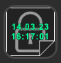

# Plugin usage with a Stream Deck device

- [Plugin usage with a Stream Deck device](#plugin-usage-with-a-stream-deck-device)
  - [Overview](#overview)
  - [Step-by-step guides](#step-by-step-guides)
    - [Saving text](#saving-text)
    - [Saving sensitive text](#saving-sensitive-text)
    - [Clearing a key](#clearing-a-key)

## Overview

The point of this plugin is to enable you to set aside some **text data** you have in your clipboard for later.
Once a key holds some text, you can paste it in most text areas by doing a quick press on the key.

## Step-by-step guides

### Saving text

- First, your key will be either empty  or any of the feature described here
- Make sure you have copied into your clipboard the text you want
- Do a short press on the key with the plugin (**between 0.5 and 1 second**)
- When you release the key should show you a preview of the text saved 

### Saving sensitive text

- First, your key will be either empty  or any of the feature described here
- Make sure you have copied into your clipboard the text you want
- Do a medium press on the key with the plugin (**between 1 and 3 seconds**)
- When you release the key should show you a secure background with the timestamp of the save event 

### Clearing a key

- First, your key will contain either a regular text  or secure text 
- Do a long press on the key (**3 seconds or longer**)
- When you release the key it should be back to the empty image 
